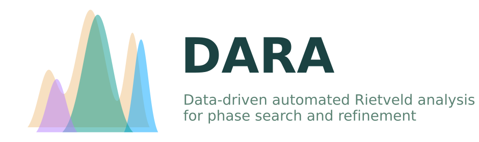

# DARA: Data-driven automated Rietveld analysis for phase search and refinement

Automated phase search with BGMN.

## Installation
First, git clone the repository. Then navigate to the directory and pip install:

```bash
git clone https://github.com/idocx/dara
cd dara
pip install -e .
```

For more details about installation, please refer to [installation guide](https://idocx.github.io/dara/install.html).